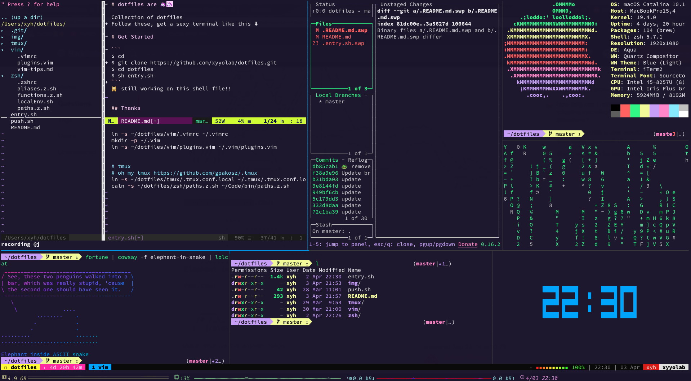

# dotfiles are 🦄🦄

Collection of dotfiles

Follow these dotfiles, get a sexy terminal like this ⬇︎



 - [notes](./src/README.md)


# Get Started


```
$ cd 
$ git clone https://github.com/xyyolab/dotfiles.git
$ cd dotfiles
$ sh entry.sh
```

🙀 still working on this shell file!!


## Thanks

 - [Oh-My-Zsh](https://github.com/ohmyzsh/ohmyzsh)
 - [Oh-My-Tmux](https://github.com/gpakosz/.tmux)
 - [zsh-users](https://github.com/zsh-users)

