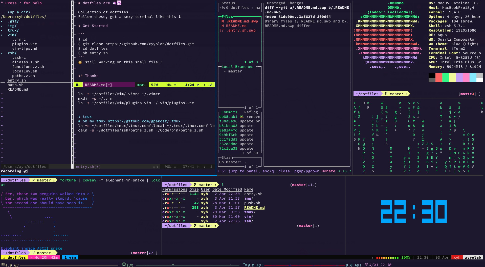

# dotfiles are 🦄🦄

# Get Started

```
$ cd
$ git clone https://github.com/xyyolab/dotfiles.git
$ cd dotfiles
$ sh bootstrap.sh
```

## After executed `bootstrap.sh`



## Using

- [Oh-My-Zsh](https://github.com/ohmyzsh/ohmyzsh)
  - [zsh-users](https://github.com/zsh-users)
  - [powerlevel10k](https://github.com/romkatv/powerlevel10k)
- [Vundle.vim](https://github.com/VundleVim/Vundle.vim)
- [Oh-My-Tmux](https://github.com/gpakosz/.tmux)
- [nvm](https://github.com/nvm-sh/nvm)
- [fzf](https://github.com/junegunn/fzf)
- [fasd](https://github.com/clvv/fasd)

Modified at: `DATE: 2021-10-17 TIME: 15:46:50`
